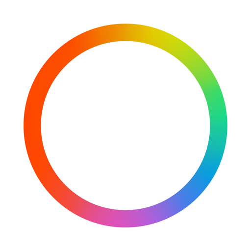
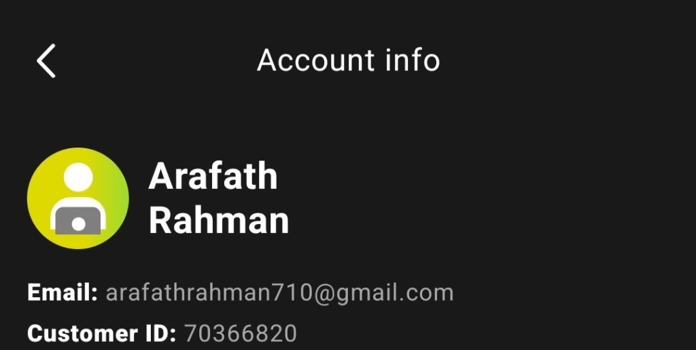

# Windows 11 Web OS

An interactive, responsive, and full-featured replica of the Windows 11 desktop experience running right in your web browser. Built with **React 18**, **Redux**, **Vite**, **Sass (SCSS)**, and **TailwindCSS**.

Developed and maintained by **[Arafath Rahman](https://github.com/smartworldarafath)**.

### 🌐 [Live Demo Experience](https://smartworldarafath.github.io/Windows-11-Web-OS/)
**Live Web OS URL**: [https://smartworldarafath.github.io/Windows-11-Web-OS/](https://smartworldarafath.github.io/Windows-11-Web-OS/)

---

## 📸 Screenshots & Preview


---

## ✨ Features & Enhancements

### 📂 File Explorer (This PC & Full File Operations)
- **This PC View**: Displays storage capacity progress bars for `OS (C:)` and `Data (D:)` along with user libraries (Desktop, Documents, Downloads, Music, Pictures, Videos).
- **File CRUD Operations**: Create **New Folder** and **New Text Document**, **Rename**, **Delete**, **Cut**, **Copy**, and **Paste**.
- **Interactive Context Menu**: Right-click context menus for files, folders, and empty directory backgrounds.
- **Path Breadcrumbs & Search**: Live directory hierarchy and instantaneous file filtering.

### 🖥️ Draggable Desktop Applications
- Freely drag desktop app icons to any position on the screen.
- Auto-snapping to the nearest grid cell on release.
- Icon positions are automatically preserved in `localStorage`.

### 🌐 Web Browsers
- **Google Chrome**: Full browser experience with dynamic tab creation, close tabs, omnibox with Google search queries, and quick bookmarks bar.
- **Microsoft Edge**: In-browser web viewer with navigation controls and web bookmarks.

### 🛍️ Microsoft Store
- Browse **Featured Apps**, **Featured Games**, and **Featured Films**.
- Interactive Detail Pages with screenshots, ratings, reviews, and package descriptions.
- Instant app install and launch flow.

### 🛠️ Built-in Windows 11 Native Apps
- **Clock**:
  - ⏱️ **Stopwatch** with lap tracking and split time records.
  - ⏳ **Timer** with countdown ring animation and quick presets (1m, 3m, 5m, 10m, 15m, 30m).
  - ⏰ **Alarms** with toggle switches.
  - 🌐 **World Clock** with live times for Dhaka, New York, London, Tokyo, Paris, Dubai.
- **Paint**: HTML5 drawing canvas with Pencil, Brush, Eraser, Shapes (Line, Rect, Circle), 16-color palette, custom color picker, stroke size selector, Undo, and Save/Download image as PNG.
- **Voice Recorder**: Audio recording with live animated frequency waveform visualizer, playback controls, and recording manager.
- **Weather**: Live current weather overview, hourly forecast, 7-day extended forecast, city search (Dhaka, New York, London, Tokyo, etc.), and °C / °F toggle.
- **Calculator**: Standard and scientific arithmetic operations.
- **Camera**: Live camera view and snapshot photo capture.
- **Notepad**: Text editor with file save and editing capabilities.
- **Terminal (Command Prompt / PowerShell)**: Interactive command line with custom commands and system info.

### ⚙️ Settings & Personalization
- Personalized system specs showing **ARAFATH-PC** and **Windows 11 Web OS**.
- Light and Dark theme switching with authentic Windows 11 Mica / Acrylic blur effects.
- Wallpaper collection with live theme application.

### 🚀 Desktop & Shell UI
- **Start Menu**: Pinned apps, recommended files, user profile, and power options.
- **Taskbar**: Centered app icons, active window indicators, and pinned shortcuts.
- **Action Center & Quick Settings**: Wi-Fi, Bluetooth, Airplane mode, Battery saver, Brightness, and Volume sliders.
- **Notification Center & Calendar**: Interactive calendar widget and notifications.
- **Widgets Pane**: Live news and widget cards.
- **Window Management**: Maximize, minimize, custom resize, draggable window header, and snap layouts.

---

## 🛠️ Tech Stack

- **Frontend**: React 18
- **State Management**: Redux
- **Build Tool / Bundler**: Vite
- **Styling**: Sass (SCSS) + CSS Modules + TailwindCSS
- **Icons**: FontAwesome & SVG Windows Icons

---

## 🚀 Getting Started (Local Development)

Follow these steps to run the project locally on your machine:

### Prerequisites
- Node.js (v16 or higher recommended)
- npm or yarn

### Installation

1. **Clone the repository:**
   ```bash
   git clone https://github.com/smartworldarafath/Windows-11-Web-OS.git
   cd Windows-11-Web-OS
   ```

2. **Install dependencies:**
   ```bash
   npm install --legacy-peer-deps
   ```

3. **Start the development server:**
   ```bash
   npm start
   ```

4. **Open in browser:**
   Navigate to `http://localhost:5173/` in your browser.

### Building for Production
```bash
npm run build
```

---

## 👨‍💻 Developer & Author

- **Developer**: [Arafath Rahman](https://github.com/smartworldarafath)
- **GitHub**: [@smartworldarafath](https://github.com/smartworldarafath)
- **Repository**: [https://github.com/smartworldarafath/Windows-11-Web-OS](https://github.com/smartworldarafath/Windows-11-Web-OS)

---

## 📄 License

This project is open source and available under the [CC0-1.0 License](LICENSE).

---

## ⚠️ Disclaimer

This project is an open-source web simulation created for educational and experimental purposes. It is not affiliated with, sponsored by, or endorsed by Microsoft Corporation. Windows and related trademarks are properties of Microsoft Corporation.


---

## ☕ Support / Buy Me a Coffee & Become a Sponsor

If you find **Windows 11 Web OS** helpful and want to support ongoing development, maintenance, and new features, consider contributing through any of the options below! Your support means the world and helps keep this project open-source.

<div align="center">

<table>
  <tr>

    <td align="center" width="25%" valign="top">
      <h4> SupportKori</h4>
      <a href="https://www.supportkori.com/arafathrahman" target="_blank">
        
      </a><br/><br/>
      <a href="https://www.supportkori.com/arafathrahman" target="_blank">
        
      </a><br/>
      <sub>Cards / bKash / Nagad / Global</sub>
    </td>
    <td align="center" width="25%" valign="top">
      <h4> nsave</h4>
      <br/><br/>
      <br/>
      <sub>Ntag: <code>@arafath_rahman9</code></sub>
    </td>
    <td align="center" width="25%" valign="top">
      <h4> RedotPay</h4>
      <br/><br/>
      <br/>
      <sub>ID: <code>1965421414</code></sub>
    </td>
    <td align="center" width="25%" valign="top">
      <h4> Payoneer</h4>
      <br/><br/>
      <a href="mailto:arafathrahman710@gmail.com?subject=Support%20via%20Payoneer">
        
      </a><br/>
      <sub>Email: <code>arafathrahman710@gmail.com</code></sub>
    </td>
  </tr>
</table>

<br/>

| Method | Details / Direct Link |
| :--- | :--- |
| ** SupportKori** | [https://www.supportkori.com/arafathrahman](https://www.supportkori.com/arafathrahman) |
| ** nsave** | Ntag: `@arafath_rahman9` • `Md Arafath Rahman` |
| ** RedotPay** | Account ID: `1965421414` |
| ** Payoneer** | Email: `arafathrahman710@gmail.com` • Customer ID: `70366820` |

</div>


---

<div align="center">

<a href="SUPPORT.md" target="_blank">
  
</a>
<br/>
<sub><b>▲ Tap the sticker for the full support page &mdash; or expand every payment option &amp; the payment QR codes right here</b></sub>

<details>
<summary>
  <sub><b>Show all payment options &amp; QR codes</b></sub>
</summary>

<br/>

<table>
  <tr>
    <td align="center" width="25%" valign="top">
      <h4> SupportKori</h4>
      <a href="https://www.supportkori.com/arafathrahman" target="_blank">
        
      </a><br/>
      <sub>Cards / bKash / Nagad<br/><a href="https://www.supportkori.com/arafathrahman">supportkori.com/arafathrahman</a></sub>
    </td>
    <td align="center" width="25%" valign="top">
      <h4> nsave</h4>
      <br/>
      <sub>Ntag: <code>@arafath_rahman9</code></sub>
    </td>
    <td align="center" width="25%" valign="top">
      <h4> RedotPay</h4>
      <br/>
      <sub>Account ID: <code>1965421414</code></sub>
    </td>
    <td align="center" width="25%" valign="top">
      <h4> Payoneer</h4>
      <br/>
      <sub><code>arafathrahman710@gmail.com</code><br/>Customer ID: <code>70366820</code></sub>
    </td>
  </tr>
</table>

<br/>

**🌍 Outside Bangladesh?** One-tap online support &mdash; cards, Apple Pay &amp; Google Pay:

<a href="https://www.buymeacoffee.com/arafathrahman" target="_blank">
  
</a>

</details>

</div>